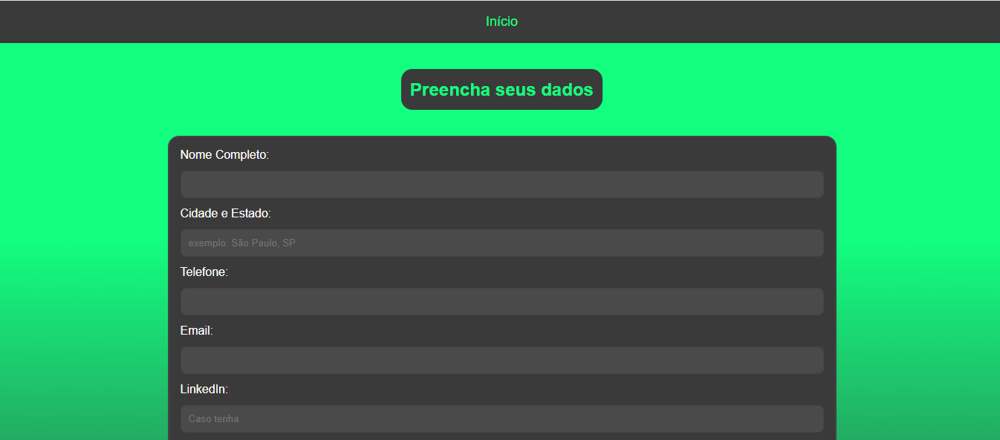

# Building-Curriculum

Este site foi desenvolvido como parte de um Trabalho de Conclusão de Curso e tem como objetivo oferecer uma forma  
prática e rápida de criar um currículo profissional.

A plataforma disponibiliza um único modelo de currículo, pensado para ser simples, organizado e compatível com as  
exigências mais comuns do mercado de trabalho. O usuário só precisa preencher seus dados e, em poucos cliques, gera um currículo pronto para download em PDF.

### Editor
O site oferece vários campos para preenchimento e inclui  
um campo de GitHub caso a pessoa possua.

  

### Resultado final

O site gera um arquivo PDF para envio fácil.  
Exemplo de currículo criado:  

### Dependências

[jsPdf](https://mozilla.github.io/pdf.js/getting_started/)

### Criadores
[Hiago](https://github.com/hiagosso)  
[Kaiky](https://github.com/KKZITOS)  
[Fellipe](https://github.com/Flipinho)
